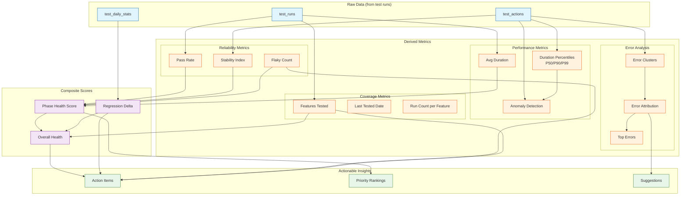
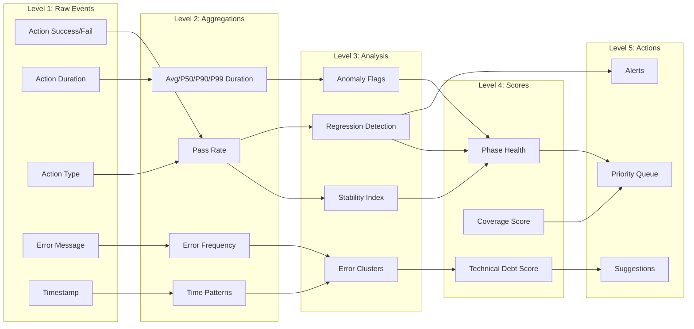

# TML Testing Analytics Dashboard — Full Specification

**Purpose:** Transform the analytics dashboard from basic "what happened" metrics into actionable insights that drive testing improvement.

---

## Core Philosophy

The dashboard should answer these questions in priority order:

1. **What needs my attention right now?** (Action items)
2. **Is my test suite getting better or worse?** (Trends)
3. **What should I fix first?** (Prioritization)
4. **Is this a real bug or test flakiness?** (Reliability)
5. **Where are the bottlenecks?** (Performance)
6. **What's not being tested?** (Coverage gaps)

---

## KPI Relationship Diagram



### KPI Dependency Chain



---

## Database Schema Changes

### New Tables

```sql
-- ============================================
-- 1. STABILITY TRACKING
-- ============================================

-- Track consecutive results for stability calculation
CREATE TABLE test_action_history (
    id UUID PRIMARY KEY DEFAULT gen_random_uuid(),
    action_type TEXT NOT NULL,
    phase TEXT NOT NULL,
    success BOOLEAN NOT NULL,
    run_id UUID REFERENCES test_runs(id) ON DELETE CASCADE,
    created_at TIMESTAMPTZ DEFAULT NOW(),
    
    -- For quick stability lookups
    previous_result BOOLEAN,
    streak_count INTEGER DEFAULT 1,  -- consecutive same results
    
    CONSTRAINT valid_phase CHECK (phase IN (
        'preseason', 'submission', 'playlist', 
        'voting', 'reveal', 'archived'
    ))
);

CREATE INDEX idx_action_history_type_created 
    ON test_action_history(action_type, created_at DESC);
CREATE INDEX idx_action_history_phase 
    ON test_action_history(phase, created_at DESC);


-- ============================================
-- 2. ERROR CLUSTERING
-- ============================================

-- Normalized error patterns for clustering
CREATE TABLE error_patterns (
    id UUID PRIMARY KEY DEFAULT gen_random_uuid(),
    
    -- Pattern identification
    error_signature TEXT NOT NULL,  -- normalized error (no IDs, timestamps)
    error_category TEXT NOT NULL,   -- e.g., 'rate_limit', 'timeout', 'validation'
    
    -- Attribution
    attribution TEXT NOT NULL CHECK (attribution IN (
        'external_dependency',  -- third-party API
        'app_code',            -- bug in application
        'test_code',           -- bug in test implementation  
        'test_data',           -- data setup/cleanup issue
        'environment',         -- infrastructure/config
        'unknown'
    )),
    
    -- Affected areas
    affected_phases TEXT[] DEFAULT '{}',
    affected_actions TEXT[] DEFAULT '{}',
    
    -- Suggested fix
    suggestion TEXT,
    
    -- Metadata
    first_seen TIMESTAMPTZ DEFAULT NOW(),
    last_seen TIMESTAMPTZ DEFAULT NOW(),
    occurrence_count INTEGER DEFAULT 1,
    
    -- Manual override for attribution
    attribution_confirmed BOOLEAN DEFAULT FALSE,
    
    UNIQUE(error_signature)
);

CREATE INDEX idx_error_patterns_category ON error_patterns(error_category);
CREATE INDEX idx_error_patterns_attribution ON error_patterns(attribution);
CREATE INDEX idx_error_patterns_last_seen ON error_patterns(last_seen DESC);

-- Link individual errors to patterns
CREATE TABLE error_occurrences (
    id UUID PRIMARY KEY DEFAULT gen_random_uuid(),
    pattern_id UUID REFERENCES error_patterns(id) ON DELETE CASCADE,
    action_id UUID REFERENCES test_actions(id) ON DELETE CASCADE,
    run_id UUID REFERENCES test_runs(id) ON DELETE CASCADE,
    raw_error_message TEXT,
    occurred_at TIMESTAMPTZ DEFAULT NOW(),
    
    -- Context for debugging
    context JSONB DEFAULT '{}'  -- action params, state, etc.
);

CREATE INDEX idx_error_occurrences_pattern ON error_occurrences(pattern_id, occurred_at DESC);
CREATE INDEX idx_error_occurrences_time ON error_occurrences(occurred_at DESC);


-- ============================================
-- 3. FEATURE COVERAGE TRACKING
-- ============================================

-- Define all testable features
CREATE TABLE test_features (
    id UUID PRIMARY KEY DEFAULT gen_random_uuid(),
    
    -- Feature identification
    feature_key TEXT UNIQUE NOT NULL,  -- e.g., 'ai.story_generation'
    feature_name TEXT NOT NULL,        -- e.g., 'AI Story Generation'
    category TEXT NOT NULL,            -- e.g., 'ai_features', 'minigames', 'core_flow'
    
    -- Importance for prioritization
    priority TEXT DEFAULT 'medium' CHECK (priority IN ('critical', 'high', 'medium', 'low')),
    
    -- Coverage targets
    min_runs_per_week INTEGER DEFAULT 10,
    max_days_without_test INTEGER DEFAULT 7,
    
    -- Current state (updated by triggers)
    last_tested_at TIMESTAMPTZ,
    total_runs INTEGER DEFAULT 0,
    success_rate NUMERIC(5,2),
    
    created_at TIMESTAMPTZ DEFAULT NOW()
);

-- Seed with known features
INSERT INTO test_features (feature_key, feature_name, category, priority) VALUES
    -- Core Flow
    ('core.user_creation', 'User Creation', 'core_flow', 'critical'),
    ('core.submission_processing', 'Submission Processing', 'core_flow', 'critical'),
    ('core.vote_processing', 'Vote Processing', 'core_flow', 'critical'),
    ('core.reveal_flow', 'Reveal Flow', 'core_flow', 'critical'),
    
    -- AI Features
    ('ai.story_generation', 'Round Story Generation', 'ai_features', 'high'),
    ('ai.banner_generation', 'Round Banner Generation', 'ai_features', 'high'),
    ('ai.historical_awards', 'Historical Awards', 'ai_features', 'medium'),
    ('ai.season_stories', 'Season Stories', 'ai_features', 'medium'),
    ('ai.theme_suggestions', 'Theme Suggestions', 'ai_features', 'low'),
    ('ai.round_images', 'Round Image Generation', 'ai_features', 'medium'),
    
    -- Minigames
    ('minigame.submitter_guess', 'Submitter Guess', 'minigames', 'high'),
    ('minigame.timeline_game', 'Timeline Game', 'minigames', 'high'),
    ('minigame.round_challenge', 'Round Challenge', 'minigames', 'medium'),
    
    -- Edge Cases
    ('edge.missed_submission_deadline', 'Missed Submission Deadline', 'edge_cases', 'medium'),
    ('edge.missed_voting_deadline', 'Missed Voting Deadline', 'edge_cases', 'medium'),
    ('edge.admin_self_entry', 'Admin Self-Entry Flow', 'edge_cases', 'high'),
    ('edge.partial_submissions', 'Partial Submissions', 'edge_cases', 'medium'),
    
    -- Communication
    ('comm.chat', 'Chat', 'communication', 'medium'),
    ('comm.dm', 'Direct Messages', 'communication', 'medium'),
    ('comm.notifications', 'Notifications', 'communication', 'high');

-- Track which features are exercised by which actions
CREATE TABLE feature_action_mapping (
    feature_id UUID REFERENCES test_features(id) ON DELETE CASCADE,
    action_type TEXT NOT NULL,
    PRIMARY KEY (feature_id, action_type)
);


-- ============================================
-- 4. PHASE HEALTH AGGREGATION
-- ============================================

CREATE TABLE phase_health_stats (
    id UUID PRIMARY KEY DEFAULT gen_random_uuid(),
    
    phase TEXT NOT NULL,
    calculated_at TIMESTAMPTZ DEFAULT NOW(),
    window_days INTEGER DEFAULT 7,  -- lookback period
    
    -- Core metrics
    total_actions INTEGER,
    successful_actions INTEGER,
    pass_rate NUMERIC(5,2),
    
    -- Stability
    stability_index NUMERIC(5,2),  -- % of actions with consistent results
    flaky_action_count INTEGER,
    
    -- Performance
    avg_duration_ms INTEGER,
    p50_duration_ms INTEGER,
    p90_duration_ms INTEGER,
    p99_duration_ms INTEGER,
    
    -- Composite score (0-100)
    health_score NUMERIC(5,2),
    
    -- Comparison to previous period
    pass_rate_delta NUMERIC(5,2),
    duration_delta_pct NUMERIC(5,2),
    
    UNIQUE(phase, calculated_at, window_days)
);

CREATE INDEX idx_phase_health_phase_time 
    ON phase_health_stats(phase, calculated_at DESC);


-- ============================================
-- 5. REGRESSION TRACKING
-- ============================================

CREATE TABLE regression_events (
    id UUID PRIMARY KEY DEFAULT gen_random_uuid(),
    
    -- What regressed
    subject_type TEXT NOT NULL,  -- 'action', 'phase', 'feature'
    subject_key TEXT NOT NULL,   -- action_type, phase name, or feature_key
    
    -- Regression details
    metric TEXT NOT NULL,        -- 'pass_rate', 'duration', 'stability'
    previous_value NUMERIC,
    current_value NUMERIC,
    change_pct NUMERIC(5,2),
    
    -- When detected
    detected_at TIMESTAMPTZ DEFAULT NOW(),
    first_seen_at TIMESTAMPTZ,   -- when the degradation started
    
    -- Status
    status TEXT DEFAULT 'open' CHECK (status IN ('open', 'investigating', 'resolved', 'wont_fix')),
    resolved_at TIMESTAMPTZ,
    resolution_notes TEXT,
    
    -- Severity
    severity TEXT DEFAULT 'medium' CHECK (severity IN ('critical', 'high', 'medium', 'low'))
);

CREATE INDEX idx_regression_status ON regression_events(status, detected_at DESC);
CREATE INDEX idx_regression_subject ON regression_events(subject_type, subject_key);


-- ============================================
-- 6. HOURLY STATS FOR TIME PATTERNS
-- ============================================

CREATE TABLE test_hourly_stats (
    id UUID PRIMARY KEY DEFAULT gen_random_uuid(),
    
    hour_bucket TIMESTAMPTZ NOT NULL,  -- truncated to hour
    day_of_week INTEGER,               -- 0=Sunday, 6=Saturday
    hour_of_day INTEGER,               -- 0-23
    
    total_runs INTEGER DEFAULT 0,
    failed_runs INTEGER DEFAULT 0,
    total_actions INTEGER DEFAULT 0,
    failed_actions INTEGER DEFAULT 0,
    
    avg_duration_ms INTEGER,
    
    UNIQUE(hour_bucket)
);

CREATE INDEX idx_hourly_stats_dow_hour 
    ON test_hourly_stats(day_of_week, hour_of_day);
```

### Schema Modifications to Existing Tables

```sql
-- ============================================
-- MODIFY test_actions
-- ============================================

ALTER TABLE test_actions ADD COLUMN IF NOT EXISTS 
    phase TEXT;

ALTER TABLE test_actions ADD COLUMN IF NOT EXISTS 
    feature_keys TEXT[] DEFAULT '{}';  -- features exercised by this action

ALTER TABLE test_actions ADD COLUMN IF NOT EXISTS
    duration_ms INTEGER;  -- explicit duration in ms

ALTER TABLE test_actions ADD COLUMN IF NOT EXISTS
    is_flaky BOOLEAN DEFAULT FALSE;  -- flagged as flaky

ALTER TABLE test_actions ADD COLUMN IF NOT EXISTS
    error_pattern_id UUID REFERENCES error_patterns(id);

-- Add phase constraint
ALTER TABLE test_actions ADD CONSTRAINT valid_action_phase 
    CHECK (phase IS NULL OR phase IN (
        'preseason', 'submission', 'playlist', 
        'voting', 'reveal', 'archived'
    ));

CREATE INDEX idx_test_actions_phase ON test_actions(phase);
CREATE INDEX idx_test_actions_flaky ON test_actions(is_flaky) WHERE is_flaky = TRUE;


-- ============================================
-- MODIFY test_runs  
-- ============================================

ALTER TABLE test_runs ADD COLUMN IF NOT EXISTS
    phases_completed TEXT[] DEFAULT '{}';

ALTER TABLE test_runs ADD COLUMN IF NOT EXISTS
    failure_phase TEXT;  -- which phase failed (if any)

ALTER TABLE test_runs ADD COLUMN IF NOT EXISTS
    is_full_round BOOLEAN DEFAULT FALSE;  -- complete round vs partial test
```

### Triggers and Functions

```sql
-- ============================================
-- TRIGGER: Update stability on new action
-- ============================================

CREATE OR REPLACE FUNCTION update_action_stability()
RETURNS TRIGGER AS $$
DECLARE
    prev_results BOOLEAN[];
    consistency_count INTEGER;
BEGIN
    -- Get last 4 results for this action type (including current)
    SELECT ARRAY_AGG(success ORDER BY created_at DESC)
    INTO prev_results
    FROM (
        SELECT success, created_at
        FROM test_action_history
        WHERE action_type = NEW.action_type
        ORDER BY created_at DESC
        LIMIT 4
    ) sub;
    
    -- Check if last 3 results before this one were the same
    IF array_length(prev_results, 1) >= 4 THEN
        IF prev_results[2] = prev_results[3] AND prev_results[3] = prev_results[4] THEN
            -- Previous 3 were consistent
            IF NEW.success = prev_results[2] THEN
                -- This one matches = stable
                NEW.streak_count := 4;
            ELSE
                -- This one breaks the streak
                NEW.streak_count := 1;
            END IF;
        END IF;
    END IF;
    
    NEW.previous_result := prev_results[2];  -- immediate previous
    
    RETURN NEW;
END;
$$ LANGUAGE plpgsql;

CREATE TRIGGER trg_action_stability
    BEFORE INSERT ON test_action_history
    FOR EACH ROW
    EXECUTE FUNCTION update_action_stability();


-- ============================================
-- TRIGGER: Cluster errors on insert
-- ============================================

CREATE OR REPLACE FUNCTION cluster_error_on_insert()
RETURNS TRIGGER AS $$
DECLARE
    normalized_sig TEXT;
    pattern_uuid UUID;
BEGIN
    IF NEW.success = FALSE AND NEW.error_message IS NOT NULL THEN
        -- Normalize error message (remove UUIDs, timestamps, specific IDs)
        normalized_sig := regexp_replace(
            regexp_replace(
                regexp_replace(NEW.error_message, 
                    '[0-9a-f]{8}-[0-9a-f]{4}-[0-9a-f]{4}-[0-9a-f]{4}-[0-9a-f]{12}', 
                    '<UUID>', 'gi'),
                '\d{4}-\d{2}-\d{2}[T ]\d{2}:\d{2}:\d{2}',
                '<TIMESTAMP>', 'gi'),
            '\b\d{10,}\b',
            '<ID>', 'gi'
        );
        
        -- Find or create pattern
        INSERT INTO error_patterns (error_signature, error_category, attribution)
        VALUES (
            normalized_sig,
            CASE 
                WHEN normalized_sig ILIKE '%rate limit%' THEN 'rate_limit'
                WHEN normalized_sig ILIKE '%timeout%' THEN 'timeout'
                WHEN normalized_sig ILIKE '%constraint%' THEN 'constraint_violation'
                WHEN normalized_sig ILIKE '%not found%' THEN 'not_found'
                WHEN normalized_sig ILIKE '%invalid%' THEN 'validation'
                ELSE 'unknown'
            END,
            CASE
                WHEN normalized_sig ILIKE '%spotify%' OR normalized_sig ILIKE '%openai%' 
                    THEN 'external_dependency'
                WHEN normalized_sig ILIKE '%constraint%' OR normalized_sig ILIKE '%duplicate%'
                    THEN 'test_data'
                ELSE 'unknown'
            END
        )
        ON CONFLICT (error_signature) 
        DO UPDATE SET 
            last_seen = NOW(),
            occurrence_count = error_patterns.occurrence_count + 1
        RETURNING id INTO pattern_uuid;
        
        -- Link this action to the pattern
        NEW.error_pattern_id := pattern_uuid;
        
        -- Record occurrence
        INSERT INTO error_occurrences (pattern_id, action_id, run_id, raw_error_message, context)
        VALUES (pattern_uuid, NEW.id, NEW.run_id, NEW.error_message, 
                jsonb_build_object('action_type', NEW.action_type, 'phase', NEW.phase));
    END IF;
    
    RETURN NEW;
END;
$$ LANGUAGE plpgsql;

CREATE TRIGGER trg_cluster_errors
    BEFORE INSERT ON test_actions
    FOR EACH ROW
    EXECUTE FUNCTION cluster_error_on_insert();


-- ============================================
-- FUNCTION: Calculate phase health
-- ============================================

CREATE OR REPLACE FUNCTION calculate_phase_health(
    p_phase TEXT,
    p_window_days INTEGER DEFAULT 7
)
RETURNS TABLE (
    phase TEXT,
    total_actions INTEGER,
    successful_actions INTEGER,
    pass_rate NUMERIC,
    stability_index NUMERIC,
    flaky_count INTEGER,
    avg_duration_ms INTEGER,
    p50_duration_ms INTEGER,
    p90_duration_ms INTEGER,
    p99_duration_ms INTEGER,
    health_score NUMERIC
) AS $$
BEGIN
    RETURN QUERY
    WITH action_stats AS (
        SELECT 
            COUNT(*) as total,
            COUNT(*) FILTER (WHERE ta.success) as successful,
            AVG(ta.duration_ms) as avg_dur,
            PERCENTILE_CONT(0.5) WITHIN GROUP (ORDER BY ta.duration_ms) as p50,
            PERCENTILE_CONT(0.9) WITHIN GROUP (ORDER BY ta.duration_ms) as p90,
            PERCENTILE_CONT(0.99) WITHIN GROUP (ORDER BY ta.duration_ms) as p99
        FROM test_actions ta
        JOIN test_runs tr ON ta.run_id = tr.id
        WHERE ta.phase = p_phase
          AND tr.created_at > NOW() - (p_window_days || ' days')::INTERVAL
    ),
    stability_stats AS (
        SELECT 
            COUNT(*) FILTER (WHERE streak_count >= 3) as stable_count,
            COUNT(*) as total_count
        FROM test_action_history
        WHERE phase = p_phase
          AND created_at > NOW() - (p_window_days || ' days')::INTERVAL
    ),
    flaky_stats AS (
        SELECT COUNT(DISTINCT action_type) as flaky
        FROM test_actions
        WHERE phase = p_phase
          AND is_flaky = TRUE
          AND created_at > NOW() - (p_window_days || ' days')::INTERVAL
    )
    SELECT 
        p_phase,
        a.total::INTEGER,
        a.successful::INTEGER,
        ROUND((a.successful::NUMERIC / NULLIF(a.total, 0)) * 100, 2),
        ROUND((s.stable_count::NUMERIC / NULLIF(s.total_count, 0)) * 100, 2),
        f.flaky::INTEGER,
        a.avg_dur::INTEGER,
        a.p50::INTEGER,
        a.p90::INTEGER,
        a.p99::INTEGER,
        -- Health score formula: 40% pass rate + 30% stability + 30% performance
        ROUND(
            (COALESCE((a.successful::NUMERIC / NULLIF(a.total, 0)) * 100, 0) * 0.4) +
            (COALESCE((s.stable_count::NUMERIC / NULLIF(s.total_count, 0)) * 100, 0) * 0.3) +
            (CASE 
                WHEN a.p90 IS NULL THEN 0
                WHEN a.p90 < 1000 THEN 100  -- under 1s = perfect
                WHEN a.p90 < 5000 THEN 80   -- under 5s = good
                WHEN a.p90 < 10000 THEN 60  -- under 10s = okay
                ELSE 40                      -- over 10s = slow
            END * 0.3),
            2
        )
    FROM action_stats a, stability_stats s, flaky_stats f;
END;
$$ LANGUAGE plpgsql;


-- ============================================
-- FUNCTION: Detect regressions
-- ============================================

CREATE OR REPLACE FUNCTION detect_regressions()
RETURNS SETOF regression_events AS $$
DECLARE
    current_stats RECORD;
    previous_stats RECORD;
    regression RECORD;
BEGIN
    -- Compare current 7 days vs previous 7 days for each phase
    FOR current_stats IN 
        SELECT * FROM phase_health_stats 
        WHERE calculated_at > NOW() - INTERVAL '1 day'
          AND window_days = 7
    LOOP
        SELECT * INTO previous_stats 
        FROM phase_health_stats
        WHERE phase = current_stats.phase
          AND window_days = 7
          AND calculated_at BETWEEN NOW() - INTERVAL '14 days' AND NOW() - INTERVAL '7 days'
        ORDER BY calculated_at DESC
        LIMIT 1;
        
        IF previous_stats IS NOT NULL THEN
            -- Check pass rate regression (>10% drop)
            IF previous_stats.pass_rate - current_stats.pass_rate > 10 THEN
                INSERT INTO regression_events (
                    subject_type, subject_key, metric,
                    previous_value, current_value, change_pct,
                    severity
                ) VALUES (
                    'phase', current_stats.phase, 'pass_rate',
                    previous_stats.pass_rate, current_stats.pass_rate,
                    ((current_stats.pass_rate - previous_stats.pass_rate) / previous_stats.pass_rate) * 100,
                    CASE 
                        WHEN previous_stats.pass_rate - current_stats.pass_rate > 25 THEN 'critical'
                        WHEN previous_stats.pass_rate - current_stats.pass_rate > 15 THEN 'high'
                        ELSE 'medium'
                    END
                )
                ON CONFLICT DO NOTHING
                RETURNING * INTO regression;
                
                IF regression IS NOT NULL THEN
                    RETURN NEXT regression;
                END IF;
            END IF;
            
            -- Check duration regression (>50% slower)
            IF current_stats.p90_duration_ms > previous_stats.p90_duration_ms * 1.5 THEN
                INSERT INTO regression_events (
                    subject_type, subject_key, metric,
                    previous_value, current_value, change_pct,
                    severity
                ) VALUES (
                    'phase', current_stats.phase, 'duration',
                    previous_stats.p90_duration_ms, current_stats.p90_duration_ms,
                    ((current_stats.p90_duration_ms - previous_stats.p90_duration_ms)::NUMERIC / previous_stats.p90_duration_ms) * 100,
                    'medium'
                )
                ON CONFLICT DO NOTHING
                RETURNING * INTO regression;
                
                IF regression IS NOT NULL THEN
                    RETURN NEXT regression;
                END IF;
            END IF;
        END IF;
    END LOOP;
    
    RETURN;
END;
$$ LANGUAGE plpgsql;
```

---

## Implementation Priority Order

### Phase 1: Foundation (Week 1)
**Goal:** Get basic infrastructure in place

| Priority | Task | Effort | Value |
|----------|------|--------|-------|
| 1.1 | Add `phase` column to `test_actions` and update existing code to populate it | 2h | High |
| 1.2 | Create `error_patterns` and `error_occurrences` tables | 1h | High |
| 1.3 | Implement error clustering trigger | 3h | High |
| 1.4 | Add `duration_ms` to `test_actions` (if not present) | 1h | Medium |
| 1.5 | Create `phase_health_stats` table | 1h | Medium |

**Deliverable:** Errors automatically clustered, phases tracked

---

### Phase 2: Core Metrics (Week 2)
**Goal:** Calculate and display primary KPIs

| Priority | Task | Effort | Value |
|----------|------|--------|-------|
| 2.1 | Implement `calculate_phase_health()` function | 3h | High |
| 2.2 | Create Phase Health Cards UI component | 4h | High |
| 2.3 | Build Error Clusters panel with attribution | 4h | High |
| 2.4 | Add duration percentiles (P50/P90/P99) display | 2h | Medium |
| 2.5 | Create scheduled job to calculate phase health daily | 2h | Medium |

**Deliverable:** Dashboard shows phase health scores and error clusters

---

### Phase 3: Stability & Flakiness (Week 3)
**Goal:** Identify unreliable tests

| Priority | Task | Effort | Value |
|----------|------|--------|-------|
| 3.1 | Create `test_action_history` table | 1h | High |
| 3.2 | Implement stability tracking trigger | 3h | High |
| 3.3 | Add stability index to Phase Health Cards | 2h | High |
| 3.4 | Create "Flaky Tests" panel listing unstable actions | 3h | High |
| 3.5 | Add `is_flaky` flag and auto-detection logic | 2h | Medium |

**Deliverable:** Flaky tests identified and highlighted

---

### Phase 4: Coverage Tracking (Week 4)
**Goal:** Show what's tested and what's not

| Priority | Task | Effort | Value |
|----------|------|--------|-------|
| 4.1 | Create `test_features` table with seed data | 2h | High |
| 4.2 | Create `feature_action_mapping` and populate | 2h | High |
| 4.3 | Build Coverage Matrix UI component | 4h | High |
| 4.4 | Add "last tested" tracking per feature | 2h | Medium |
| 4.5 | Add coverage warnings (features not tested in X days) | 2h | Medium |

**Deliverable:** Dashboard shows feature coverage gaps

---

### Phase 5: Regression Detection (Week 5)
**Goal:** Automatically detect degradations

| Priority | Task | Effort | Value |
|----------|------|--------|-------|
| 5.1 | Create `regression_events` table | 1h | High |
| 5.2 | Implement `detect_regressions()` function | 4h | High |
| 5.3 | Create scheduled job to run regression detection | 1h | Medium |
| 5.4 | Build Regression Watch panel UI | 3h | High |
| 5.5 | Add severity-based alerting (optional) | 3h | Low |

**Deliverable:** Regressions auto-detected and displayed

---

### Phase 6: Time Patterns (Week 6)
**Goal:** Reveal temporal patterns in failures

| Priority | Task | Effort | Value |
|----------|------|--------|-------|
| 6.1 | Create `test_hourly_stats` table | 1h | Medium |
| 6.2 | Implement hourly aggregation trigger | 2h | Medium |
| 6.3 | Build Failure Heat Map UI component | 4h | Medium |
| 6.4 | Add day/time pattern analysis | 2h | Low |

**Deliverable:** Heat map shows when failures cluster

---

### Phase 7: Actionable Summary (Week 7)
**Goal:** Surface what needs attention

| Priority | Task | Effort | Value |
|----------|------|--------|-------|
| 7.1 | Implement action item generation logic | 4h | High |
| 7.2 | Build "What Needs Attention" panel at top of dashboard | 3h | High |
| 7.3 | Add priority ranking algorithm | 2h | Medium |
| 7.4 | Create insight generation (positive trends, etc.) | 2h | Low |
| 7.5 | Polish and integrate all panels | 4h | Medium |

**Deliverable:** Dashboard leads with actionable items

---

## UI Component Specifications

### 1. Action Items Panel (Top of Dashboard)

```
┌─────────────────────────────────────────────────────────────────────────────┐
│ 📋 WHAT NEEDS ATTENTION                                              [Hide] │
├─────────────────────────────────────────────────────────────────────────────┤
│                                                                             │
│  🔴 HIGH PRIORITY                                                          │
│  ┌─────────────────────────────────────────────────────────────────────┐   │
│  │ 1. AI Story Generation degraded 23% since Jan 7                     │   │
│  │    Pass rate: 94% → 71%  │  Duration: 12s → 23s                     │   │
│  │    [View Details] [Mark Investigating] [Dismiss]                    │   │
│  └─────────────────────────────────────────────────────────────────────┘   │
│  ┌─────────────────────────────────────────────────────────────────────┐   │
│  │ 2. 3 features have ZERO test coverage                               │   │
│  │    Season stories, Theme suggestions, Missed deadlines              │   │
│  │    [Add to Test Plan] [Dismiss]                                     │   │
│  └─────────────────────────────────────────────────────────────────────┘   │
│                                                                             │
│  🟡 MEDIUM PRIORITY                                                        │
│  ┌─────────────────────────────────────────────────────────────────────┐   │
│  │ 3. Spotify enrichment is flaky (45% stability)                      │   │
│  │    Consistent failures, not random — likely rate limiting           │   │
│  │    Suggestion: Add retry logic or use mocks in tests                │   │
│  │    [View Error Cluster] [Dismiss]                                   │   │
│  └─────────────────────────────────────────────────────────────────────┘   │
│                                                                             │
│  💡 INSIGHTS                                                               │
│  • Test runs are 18% faster this week ✨                                   │
│  • Vote processing is your most reliable phase (99.2%)                     │
│  • Most failures occur 8-9am — possible rate limit reset timing            │
│                                                                             │
└─────────────────────────────────────────────────────────────────────────────┘
```

### 2. Phase Health Cards

```
┌─────────────────────────────────────────────────────────────────────────────┐
│ PHASE HEALTH                                               [7 days ▼]      │
├─────────────────────────────────────────────────────────────────────────────┤
│                                                                             │
│ ┌─────────────┐ ┌─────────────┐ ┌─────────────┐ ┌─────────────┐            │
│ │ PRESEASON   │ │ SUBMISSION  │ │ VOTING      │ │ REVEAL      │            │
│ │             │ │          ⚠️ │ │             │ │             │            │
│ │ Score: 96   │ │ Score: 74   │ │ Score: 92   │ │ Score: 81   │            │
│ │ ━━━━━━━━━━▓ │ │ ━━━━━━━░░░░ │ │ ━━━━━━━━━░░ │ │ ━━━━━━━━░░░ │            │
│ │             │ │             │ │             │ │             │            │
│ │ Pass: 98%   │ │ Pass: 78%   │ │ Pass: 95%   │ │ Pass: 85%   │            │
│ │ Stab: 100%  │ │ Stab: 45%   │ │ Stab: 94%   │ │ Stab: 88%   │            │
│ │ P90: 1.2s   │ │ P90: 8.3s   │ │ P90: 2.1s   │ │ P90: 18.4s  │            │
│ │ Flaky: 0    │ │ Flaky: 3    │ │ Flaky: 1    │ │ Flaky: 1    │            │
│ │             │ │             │ │             │ │             │            │
│ │ ✓✓✓✓✓✓✓✓✓✓ │ │ ✓✗✓✓✗✓✗✓✓✓ │ │ ✓✓✓✓✓✓✓✓✓✗ │ │ ✓✓✓✓✗✓✓✓✓✓ │            │
│ │ (last 10)   │ │ (last 10)   │ │ (last 10)   │ │ (last 10)   │            │
│ └─────────────┘ └─────────────┘ └─────────────┘ └─────────────┘            │
│                                                                             │
│ Legend: Score = 40% pass rate + 30% stability + 30% performance            │
└─────────────────────────────────────────────────────────────────────────────┘
```

### 3. Error Clusters Panel

```
┌─────────────────────────────────────────────────────────────────────────────┐
│ ERROR CLUSTERS                                              [7 days ▼]     │
├─────────────────────────────────────────────────────────────────────────────┤
│                                                                             │
│ ┌─────────────────────────────────────────────────────────────────────────┐ │
│ │ 🔴 Spotify API Errors                                    47 occurrences │ │
│ │    Attribution: External Dependency                                     │ │
│ │    ├─ Rate limit exceeded (32)                                         │ │
│ │    ├─ Invalid track ID (12)                                            │ │
│ │    └─ Connection timeout (3)                                           │ │
│ │    Phases: Submission (enrichment)                                     │ │
│ │    Suggestion: Add retry with exponential backoff, consider caching    │ │
│ │    [View All] [Edit Attribution]                                       │ │
│ └─────────────────────────────────────────────────────────────────────────┘ │
│                                                                             │
│ ┌─────────────────────────────────────────────────────────────────────────┐ │
│ │ 🟡 AI Generation Errors                                  23 occurrences │ │
│ │    Attribution: App Code                                                │ │
│ │    ├─ Context length exceeded (18)                                     │ │
│ │    └─ Invalid JSON in response (5)                                     │ │
│ │    Phases: Reveal (story, banner)                                      │ │
│ │    Suggestion: Truncate context, add JSON validation                   │ │
│ │    [View All] [Edit Attribution]                                       │ │
│ └─────────────────────────────────────────────────────────────────────────┘ │
│                                                                             │
│ ┌─────────────────────────────────────────────────────────────────────────┐ │
│ │ 🟢 Database Constraint Errors                            8 occurrences  │ │
│ │    Attribution: Test Data                                               │ │
│ │    └─ Unique constraint on user email (8)                              │ │
│ │    Phases: Preseason (user creation)                                   │ │
│ │    Suggestion: Improve test data cleanup between runs                  │ │
│ │    [View All] [Edit Attribution]                                       │ │
│ └─────────────────────────────────────────────────────────────────────────┘ │
│                                                                             │
└─────────────────────────────────────────────────────────────────────────────┘
```

### 4. Coverage Matrix

```
┌─────────────────────────────────────────────────────────────────────────────┐
│ FEATURE COVERAGE                                           [Expand All]    │
├─────────────────────────────────────────────────────────────────────────────┤
│                                                                             │
│ ▼ Core Flow                                                   4/4 covered  │
│   ┌──────────────────────────┬─────────────┬────────┬────────┬───────────┐ │
│   │ Feature                  │ Last Tested │ Runs   │ Pass % │ Status    │ │
│   ├──────────────────────────┼─────────────┼────────┼────────┼───────────┤ │
│   │ User Creation            │ 2 hours ago │ 847    │ 98%    │ ✅ Good   │ │
│   │ Submission Processing    │ 2 hours ago │ 847    │ 78%    │ ⚠️ Flaky  │ │
│   │ Vote Processing          │ 2 hours ago │ 847    │ 99%    │ ✅ Good   │ │
│   │ Reveal Flow              │ 2 hours ago │ 847    │ 85%    │ ✅ Good   │ │
│   └──────────────────────────┴─────────────┴────────┴────────┴───────────┘ │
│                                                                             │
│ ▼ AI Features                                                 4/6 covered  │
│   ┌──────────────────────────┬─────────────┬────────┬────────┬───────────┐ │
│   │ Feature                  │ Last Tested │ Runs   │ Pass % │ Status    │ │
│   ├──────────────────────────┼─────────────┼────────┼────────┼───────────┤ │
│   │ Round Story Generation   │ 2 hours ago │ 423    │ 71%    │ ⚠️ Degrad │ │
│   │ Round Banner Generation  │ 2 hours ago │ 423    │ 89%    │ ✅ Good   │ │
│   │ Historical Awards        │ 3 days ago  │ 12     │ 83%    │ ⚠️ Stale  │ │
│   │ Season Stories           │ Never       │ 0      │ -      │ 🔴 None   │ │
│   │ Theme Suggestions        │ Never       │ 0      │ -      │ 🔴 None   │ │
│   │ Round Images             │ 1 day ago   │ 56     │ 92%    │ ✅ Good   │ │
│   └──────────────────────────┴─────────────┴────────┴────────┴───────────┘ │
│                                                                             │
│ ▶ Minigames                                                   3/3 covered  │
│ ▶ Edge Cases                                                  1/4 covered  │
│ ▶ Communication                                               2/3 covered  │
│                                                                             │
│ Overall Coverage: 14/20 features (70%)                                     │
│ ████████████████████████████░░░░░░░░░░░░                                   │
│                                                                             │
└─────────────────────────────────────────────────────────────────────────────┘
```

### 5. Failure Heat Map

```
┌─────────────────────────────────────────────────────────────────────────────┐
│ FAILURE PATTERNS BY TIME                                   [Last 30 days]  │
├─────────────────────────────────────────────────────────────────────────────┤
│                                                                             │
│         Sun    Mon    Tue    Wed    Thu    Fri    Sat                       │
│                                                                             │
│ 00:00    ·      ·      ·      ·      ·      ·      ·                        │
│ 03:00    ·      ·      ·      ·      ·      ·      ·                        │
│ 06:00    ·      ░      ·      ·      ·      ·      ·                        │
│ 09:00    ·      ▓      ░      ▓      ░      ░      ·     ← Peak failures   │
│ 12:00    ·      ░      ·      ░      ·      ·      ·                        │
│ 15:00    ·      ·      ·      ·      ·      ░      ·                        │
│ 18:00    ·      ·      ·      ·      ·      ·      ·                        │
│ 21:00    ·      ·      ·      ·      ·      ·      ·                        │
│                                                                             │
│ Legend:  · = <5%    ░ = 5-15%    ▓ = 15-30%    █ = >30% failure rate       │
│                                                                             │
│ 💡 Pattern detected: Higher failure rates 9-10am on weekdays               │
│    Possible cause: API rate limits reset at midnight, quota consumed by AM │
│                                                                             │
└─────────────────────────────────────────────────────────────────────────────┘
```

### 6. Regression Watch

```
┌─────────────────────────────────────────────────────────────────────────────┐
│ REGRESSION WATCH                                            [vs 7 days ago]│
├─────────────────────────────────────────────────────────────────────────────┤
│                                                                             │
│ 🔴 DEGRADED                                                                │
│ ┌─────────────────────────────────────────────────────────────────────────┐ │
│ │ AI Story Generation                                                     │ │
│ │                                                                         │ │
│ │ Pass Rate:  94% ──────────────────▶ 71%     (-23%)                     │ │
│ │             ████████████████████░░░░░░░░░░░░░░░░░░░░                   │ │
│ │                                                                         │ │
│ │ Duration:   12s ──────────────────▶ 23s     (+92%)                     │ │
│ │             ████████████░░░░░░░░░░░░░░░░░░░░░░░░░░░░                   │ │
│ │                                                                         │ │
│ │ First noticed: Jan 7, 14:30                                            │ │
│ │ Status: Open                      [Investigate] [Resolve] [Won't Fix]  │ │
│ └─────────────────────────────────────────────────────────────────────────┘ │
│                                                                             │
│ 🟢 IMPROVED                                                                │
│ ┌─────────────────────────────────────────────────────────────────────────┐ │
│ │ Spotify Enrichment                                                      │ │
│ │ Pass Rate:  68% ──────────────────▶ 89%     (+21%)                     │ │
│ │ Duration:   8s ───────────────────▶ 4s      (-50%)                     │ │
│ └─────────────────────────────────────────────────────────────────────────┘ │
│                                                                             │
│ ⚪ STABLE (no significant change)                                          │
│    User creation, Vote processing, Award calculation, Banner generation    │
│                                                                             │
└─────────────────────────────────────────────────────────────────────────────┘
```

### 7. Duration Analysis

```
┌─────────────────────────────────────────────────────────────────────────────┐
│ DURATION ANALYSIS                                          [Last 30 days]  │
├─────────────────────────────────────────────────────────────────────────────┤
│                                                                             │
│ Full Round Duration                                                         │
│                                                                             │
│   P50 (median):   45s  ━━━━━━━━━━━━━━━━━━━━━━━░░░░░░░░░░░░░░░░░░░░░░░░░░  │
│   P90:            68s  ━━━━━━━━━━━━━━━━━━━━━━━━━━━━━━━━░░░░░░░░░░░░░░░░░░  │
│   P99:           142s  ━━━━━━━━━━━━━━━━━━━━━━━━━━━━━━━━━━━━━━━━━━━━━━━━━━  │
│                        0s              60s            120s           180s  │
│                                                                             │
│ ⚠️ Recent Anomalies                                                        │
│ ┌───────────────────┬────────────┬──────────────────────────────────────┐  │
│ │ When              │ Duration   │ Cause                                │  │
│ ├───────────────────┼────────────┼──────────────────────────────────────┤  │
│ │ Jan 7, 14:32      │ 312s (7x)  │ AI Story took 245s (usually 12s)    │  │
│ │ Jan 5, 09:15      │ 189s (4x)  │ Spotify timeout cascade             │  │
│ │ Jan 3, 11:42      │ 156s (3x)  │ Database connection pool exhausted  │  │
│ └───────────────────┴────────────┴──────────────────────────────────────┘  │
│                                                                             │
│ Slowest Actions (by P90)                                                    │
│ ┌────────────────────────────────────┬──────────────────────────────────┐  │
│ │ Action                             │ P90 Duration                     │  │
│ ├────────────────────────────────────┼──────────────────────────────────┤  │
│ │ 1. AI Story Generation             │ 18.2s  ████████████████████████ │  │
│ │ 2. Spotify Enrichment              │ 12.4s  ████████████████░░░░░░░░ │  │
│ │ 3. Award Calculation               │  8.1s  ██████████░░░░░░░░░░░░░░ │  │
│ │ 4. Banner Generation               │  6.3s  ████████░░░░░░░░░░░░░░░░ │  │
│ │ 5. Vote Processing                 │  2.1s  ███░░░░░░░░░░░░░░░░░░░░░ │  │
│ └────────────────────────────────────┴──────────────────────────────────┘  │
│                                                                             │
└─────────────────────────────────────────────────────────────────────────────┘
```

---

## Dashboard Layout

```
┌─────────────────────────────────────────────────────────────────────────────┐
│  🎵 TML Testing Analytics                                                   │
│  League: Test Family League  │  [7 days ▼]  │  [Export JSON]  │ [🔄]       │
├─────────────────────────────────────────────────────────────────────────────┤
│                                                                             │
│  ┌─────────────────────────────────────────────────────────────────────┐   │
│  │ 📋 WHAT NEEDS ATTENTION                                             │   │
│  │ ... (collapsible, expanded by default)                              │   │
│  └─────────────────────────────────────────────────────────────────────┘   │
│                                                                             │
│  ┌─────────────────────────────────────────────────────────────────────┐   │
│  │ PHASE HEALTH                                                        │   │
│  │ [Card] [Card] [Card] [Card] [Card] [Card]                          │   │
│  └─────────────────────────────────────────────────────────────────────┘   │
│                                                                             │
│  ┌────────────────────────────────┐ ┌────────────────────────────────┐     │
│  │ ERROR CLUSTERS                 │ │ REGRESSION WATCH               │     │
│  │                                │ │                                │     │
│  │                                │ │                                │     │
│  └────────────────────────────────┘ └────────────────────────────────┘     │
│                                                                             │
│  ┌────────────────────────────────┐ ┌────────────────────────────────┐     │
│  │ FEATURE COVERAGE               │ │ FAILURE HEAT MAP               │     │
│  │                                │ │                                │     │
│  │                                │ │                                │     │
│  └────────────────────────────────┘ └────────────────────────────────┘     │
│                                                                             │
│  ┌─────────────────────────────────────────────────────────────────────┐   │
│  │ DURATION ANALYSIS                                                   │   │
│  │                                                                     │   │
│  └─────────────────────────────────────────────────────────────────────┘   │
│                                                                             │
└─────────────────────────────────────────────────────────────────────────────┘
```

---

## Summary

### New Tables (6)
1. `test_action_history` — Stability tracking
2. `error_patterns` — Error clustering
3. `error_occurrences` — Individual error instances
4. `test_features` — Feature coverage definitions
5. `phase_health_stats` — Aggregated phase metrics
6. `regression_events` — Detected regressions

### Modified Tables (2)
1. `test_actions` — Add phase, duration_ms, is_flaky, error_pattern_id
2. `test_runs` — Add phases_completed, failure_phase, is_full_round

### New Functions (3)
1. `update_action_stability()` — Trigger for stability tracking
2. `cluster_error_on_insert()` — Trigger for error clustering
3. `calculate_phase_health()` — Phase health calculation
4. `detect_regressions()` — Regression detection

### UI Components (7)
1. Action Items Panel
2. Phase Health Cards
3. Error Clusters Panel
4. Coverage Matrix
5. Failure Heat Map
6. Regression Watch
7. Duration Analysis

### Implementation Timeline
- **Week 1:** Foundation (schema, triggers)
- **Week 2:** Core metrics (phase health, error clusters)
- **Week 3:** Stability tracking
- **Week 4:** Coverage tracking
- **Week 5:** Regression detection
- **Week 6:** Time patterns
- **Week 7:** Action items & polish
