# TML Testing Dashboard — UI Specification

**Purpose:** Redesign the test control panel for clarity, workflow visibility, and ease of use.

---

## Layout Overview

Three-column layout with header and round tabs at bottom:

```
┌─────────────────────────────────────────────────────────────────────────────────┐
│  TML Testing Dashboard                                                          │
│  League: Test Family League  │  Season: Season 2  │  ☐ Auto-refresh  │ 🔄 Refresh│
├─────────────────────────────────────────────────────────────────────────────────┤
│  [Control Panel]  [Dashboard]  [App Preview]*                                   │
├─────────────────────────────────────────────────────────────────────────────────┤
│                                                                                 │
│   PHASE BLOCKS          │    BULK ACTIONS &         │    PHASE LOGS            │
│   (Left Column)         │    GENERATION UI          │    (Right Column)        │
│                         │    (Center Column)        │                          │
│   - User grids          │                           │    - Timestamped         │
│   - Content lists       │    - Generate buttons     │    - Per-phase sections  │
│   - Per-user actions    │    - Import/upload        │    - Copyable errors     │
│                         │    - Bulk operations      │                          │
│                         │                           │                          │
├─────────────────────────────────────────────────────────────────────────────────┤
│  Round Tabs:  [Round 1 ▶]  [Round 2 ▶]  [Round 3 ▶]  [+ Add Round]             │
└─────────────────────────────────────────────────────────────────────────────────┘

* App Preview tab is future enhancement
```

---

## Phase Flow Diagram

```mermaid
flowchart TD
    subgraph PRESEASON["1. PRESEASON / DATA GENERATION"]
        P1[Create Users & Family]
        P2[Generate Relationships]
        P3[Create League/Season]
        P4[Generate Historical Data - Season 1]
        P5[Import Historical CSVs]
    end

    subgraph SUBMISSION["2. OPEN FOR SUBMISSION"]
        S1[Round Created - Status: Open]
        S2[Users Submit Songs]
        S3[Admin Manual Entry]
        S4[Spotify Data Enrichment]
        S5[Decade Detection]
    end

    subgraph PLAYLIST["3. PLAYLIST CREATED"]
        PL1[All Submissions In]
        PL2[Playlist Generated]
        PL3[Music Service Links Created]
        PL4[Round Challenge Active]
    end

    subgraph VOTING["4. VOTING PERIOD"]
        V1[Status: Voting]
        V2[Users Cast Votes]
        V3[Admin Manual Vote Entry]
        V4[Submitter Guess Minigame]
        V5[Timeline Minigame]
    end

    subgraph REVEAL["5. VOTES IN / REVEAL"]
        R1[All Votes Complete]
        R2[Reveal Timer Started]
        R3[AI Story Generation]
        R4[Round Banner Generation]
        R5[Awards Calculated]
        R6[Scores Visible / Submitters Hidden]
    end

    subgraph ARCHIVED["6. ARCHIVED / COMPLETE"]
        A1[Reveal Period Ended]
        A2[Full Results Visible]
        A3[Historical Awards Updated]
        A4[Season Stories Updated]
    end

    PRESEASON -->|"▶ Jump to Submission"| SUBMISSION
    SUBMISSION -->|"▶ Jump to Playlist"| PLAYLIST
    PLAYLIST -->|"▶ Jump to Voting"| VOTING
    VOTING -->|"▶ Jump to Reveal"| REVEAL
    REVEAL -->|"▶ Jump to Archive"| ARCHIVED
```



---

## ASCII Wireframe — Detailed View

```
┌─────────────────────────────────────────────────────────────────────────────────────────┐
│  🎵 TML Testing Dashboard                                                               │
│  ─────────────────────────────────────────────────────────────────────────────────────  │
│  League: Test Family League  │  Season: Season 2  │  ☐ Auto-refresh (5s)  │ [🔄 Refresh]│
├─────────────────────────────────────────────────────────────────────────────────────────┤
│  [ Control Panel ]  [ Dashboard ]  [ App Preview ]                                      │
├─────────────────────────────────────────────────────────────────────────────────────────┤
│                           │                              │                              │
│  ╔═══════════════════════╗│  ┌────────────────────────┐  │  ┌────────────────────────┐  │
│  ║ 1. PRESEASON       ✓  ║│  │  PRESEASON ACTIONS     │  │  │  PRESEASON LOG         │  │
│  ║    (Complete)         ║│  │                        │  │  │                        │  │
│  ╠═══════════════════════╣│  │  Users: 5              │  │  │  10:23:01 ✓ Created    │  │
│  ║ Users:                ║│  │  [Generate Users]      │  │  │    5 users in family   │  │
│  ║ ┌─────┬───────┬────┐  ║│  │                        │  │  │                        │  │
│  ║ │User │Avatar │Rel │  ║│  │  Family: Test Family   │  │  │  10:23:03 ✓ Generated  │  │
│  ║ ├─────┼───────┼────┤  ║│  │  [Generate Family]     │  │  │    relationships       │  │
│  ║ │Admin│  ✓    │ -  │  ║│  │                        │  │  │                        │  │
│  ║ │Alice│  ✓    │P-C │  ║│  │  Historical Season:    │  │  │  10:23:05 ✓ Created    │  │
│  ║ │Bob  │  ✓    │Sib │  ║│  │  [Generate S1 Data]    │  │  │    league & season     │  │
│  ║ │Carol│  ✓    │A-N │  ║│  │  [Process S1 Import]   │  │  │                        │  │
│  ║ │Dave │  ✓    │Cuz │  ║│  │                        │  │  │  10:23:08 ✓ Historical │  │
│  ║ └─────┴───────┴────┘  ║│  │  Summary: 8 rounds,    │  │  │    8 rounds imported   │  │
│  ║                       ║│  │  40 submissions        │  │  │                        │  │
│  ║ Content:              ║│  └────────────────────────┘  │  └────────────────────────┘  │
│  ║ • User descriptions ✓ ║│                              │                              │
│  ║ • Avatars generated ✓ ║│         [ ▶ JUMP TO         │                              │
│  ║ • S1 CSVs ready ✓     ║│           SUBMISSION ]       │                              │
│  ╚═══════════════════════╝│                              │                              │
│          │                │                              │                              │
│          ▼                │                              │                              │
│  ╔═══════════════════════╗│  ┌────────────────────────┐  │  ┌────────────────────────┐  │
│  ║ 2. SUBMISSION      ●  ║│  │  SUBMISSION ACTIONS    │  │  │  SUBMISSION LOG        │  │
│  ║    (In Progress)      ║│  │                        │  │  │                        │  │
│  ╠═══════════════════════╣│  │  [Submit All Remaining]│  │  │  10:24:15 ✓ Admin      │  │
│  ║ Submissions: 2/5      ║│  │  [Reset All Subs]      │  │  │    submitted           │  │
│  ║ ┌─────┬────┬─────────┐║│  │                        │  │  │    "Blue Monday"       │  │
│  ║ │User │ ✓? │Song     │║│  │  Enrich Spotify Data:  │  │  │                        │  │
│  ║ ├─────┼────┼─────────┤║│  │  [Fetch All Metadata]  │  │  │  10:24:18 ✓ Alice      │  │
│  ║ │Admin│ ✓  │Blue Mon.│║│  │                        │  │  │    submitted           │  │
│  ║ │Alice│ ✓  │Bohemian │║│  │  Admin Self-Entry:     │  │  │    "Bohemian Rhap..."  │  │
│  ║ │Bob  │ ○  │    -    │║│  │  (Admin excluded from  │  │  │                        │  │
│  ║ │Carol│ ○  │    -    │║│  │   email notifications) │  │  │  10:24:20 ⏳ Waiting   │  │
│  ║ │Dave │ ○  │    -    │║│  │  [Enter Admin Sub]     │  │  │    for 3 more subs     │  │
│  ║ └─────┴────┴─────────┘║│  └────────────────────────┘  │  └────────────────────────┘  │
│  ║        [Sub] [Reset]  ║│                              │                              │
│  ║                       ║│                              │                              │
│  ║ Content:              ║│         [ ▶ JUMP TO         │                              │
│  ║ • Decades: 2/5 ✓      ║│           PLAYLIST ]        │                              │
│  ║ • Spotify links: 2/5  ║│                              │                              │
│  ╚═══════════════════════╝│                              │                              │
│          │                │                              │                              │
│          ▼                │                              │                              │
│  ┌ ─ ─ ─ ─ ─ ─ ─ ─ ─ ─ ─ ┐│  ┌────────────────────────┐  │  ┌────────────────────────┐  │
│    3. PLAYLIST CREATED   ││  │  PLAYLIST ACTIONS      │  │  │  PLAYLIST LOG          │  │
│       (Future - Disabled)││  │  (Disabled)            │  │  │  (Empty)               │  │
│  │                       ││  │                        │  │  │                        │  │
│    Waiting for all subs  ││  │  [ ] Generate Playlist │  │  │                        │  │
│  │                       ││  │  [ ] Create Links      │  │  │                        │  │
│  └ ─ ─ ─ ─ ─ ─ ─ ─ ─ ─ ─ ┘│  └────────────────────────┘  │  └────────────────────────┘  │
│          │                │                              │                              │
│          ▼                │         [ ▶ JUMP TO         │                              │
│  ┌ ─ ─ ─ ─ ─ ─ ─ ─ ─ ─ ─ ┐│           VOTING ]          │                              │
│    4. VOTING PERIOD      ││                              │                              │
│       (Future - Disabled)││                              │                              │
│  │                       ││                              │                              │
│  └ ─ ─ ─ ─ ─ ─ ─ ─ ─ ─ ─ ┘│                              │                              │
│          │                │         [ ▶ JUMP TO         │                              │
│          ▼                │           REVEAL ]          │                              │
│  ┌ ─ ─ ─ ─ ─ ─ ─ ─ ─ ─ ─ ┐│                              │                              │
│    5. VOTES IN / REVEAL  ││                              │                              │
│       (Future - Disabled)││                              │                              │
│  │                       ││                              │                              │
│  └ ─ ─ ─ ─ ─ ─ ─ ─ ─ ─ ─ ┘│                              │                              │
│          │                │         [ ▶ JUMP TO         │                              │
│          ▼                │           ARCHIVE ]         │                              │
│  ┌ ─ ─ ─ ─ ─ ─ ─ ─ ─ ─ ─ ┐│                              │                              │
│    6. ARCHIVED           ││                              │                              │
│       (Future - Disabled)││                              │                              │
│  │                       ││                              │                              │
│  └ ─ ─ ─ ─ ─ ─ ─ ─ ─ ─ ─ ┘│                              │                              │
│                           │                              │                              │
├─────────────────────────────────────────────────────────────────────────────────────────┤
│  Round Tabs:                                                                            │
│  ┌──────────────┐ ┌──────────────┐ ┌──────────────┐ ┌─────────┐                        │
│  │ Round 1  [▶] │ │ Round 2  [▶] │ │ Round 3  [▶] │ │ + Add   │                        │
│  │ (Complete)   │ │ (Active)     │ │ (Not Started)│ │  Round  │                        │
│  └──────────────┘ └──────────────┘ └──────────────┘ └─────────┘                        │
│                                                                                         │
│  [▶] = Generate/Automate entire round (animates through phases visually)               │
└─────────────────────────────────────────────────────────────────────────────────────────┘
```

---

## Detailed Phase Block: Voting Period

```
╔═══════════════════════════════════════════════════════════════════════════════════╗
║ 4. VOTING PERIOD                                                           ●      ║
║    (In Progress)                                                                  ║
╠═══════════════════════════════════════════════════════════════════════════════════╣
║                                                                                   ║
║  Votes: 3/5 users voted  │  Points per user: 2 votes (5-user league)              ║
║                                                                                   ║
║  ┌────────┬────────┬──────────────────────────────────────┬───────────┬─────────┐ ║
║  │ User   │ Voted? │ Points Given                         │ Actions   │ Reset   │ ║
║  ├────────┼────────┼──────────────────────────────────────┼───────────┼─────────┤ ║
║  │ Admin  │   ✓    │ Alice: 5pts, Bob: 3pts               │ [Edit]    │ [Reset] │ ║
║  │ Alice  │   ✓    │ Bob: 5pts, Carol: 3pts               │ [Edit]    │ [Reset] │ ║
║  │ Bob    │   ✓    │ Admin: 5pts, Dave: 3pts              │ [Edit]    │ [Reset] │ ║
║  │ Carol  │   ○    │ -                                    │ [Vote]    │    -    │ ║
║  │ Dave   │   ○    │ -                                    │ [Vote]    │    -    │ ║
║  └────────┴────────┴──────────────────────────────────────┴───────────┴─────────┘ ║
║                                                                                   ║
║  Vote Formula: (n-1)/2 rounded up = (5-1)/2 = 2 votes per user                    ║
║  Note: Users cannot vote for their own submission                                 ║
║                                                                                   ║
║  ─────────────────────────────────────────────────────────────────────────────    ║
║  Content Generated:                                                               ║
║  ┌──────────────────┬─────────────────────────────────────┐                       ║
║  │ Item             │ Status                              │                       ║
║  ├──────────────────┼─────────────────────────────────────┤                       ║
║  │ Submitter Guess  │ ✓ Minigame active                   │                       ║
║  │ Timeline Game    │ ✓ Minigame active                   │                       ║
║  │ Vote tracking    │ 3/5 recorded                        │                       ║
║  └──────────────────┴─────────────────────────────────────┘                       ║
║                                                                                   ║
╚═══════════════════════════════════════════════════════════════════════════════════╝
```

---

## Visual State System

### Phase Block States

| State | Border | Shadow | Background | Buttons |
|-------|--------|--------|------------|---------|
| **Future** | Gray dashed | None (flat) | Light gray | Disabled |
| **Current** | Blue solid (2px) | Large drop shadow (elevated) | White | Enabled |
| **Complete** | Green solid (2px) | Medium sharp shadow | White | Enabled (for review) |
| **Past** | Green solid (1px, muted) | Small shadow | Slightly dulled | Enabled (read-only) |

### Button States

```css
/* Base button */
.btn {
  transition: all 0.15s ease;
  cursor: pointer;
}

/* Hover - slight lift */
.btn:hover {
  transform: translateY(-1px);
  box-shadow: 0 2px 4px rgba(0,0,0,0.1);
}

/* Active/Pressed - push down */
.btn:active {
  transform: translateY(1px);
  box-shadow: inset 0 1px 2px rgba(0,0,0,0.1);
}

/* Loading state */
.btn.loading {
  pointer-events: none;
  opacity: 0.7;
}
.btn.loading::after {
  content: "";
  /* spinner animation */
}

/* Disabled */
.btn:disabled {
  opacity: 0.4;
  cursor: not-allowed;
  transform: none;
}
```

---

## Log Entry Format

```
┌─────────────────────────────────────────────────────────────────────────┐
│  SUBMISSION LOG                                                    [📋] │
├─────────────────────────────────────────────────────────────────────────┤
│                                                                         │
│  10:24:15  ✓  User submission created                                   │
│               Action: INSERT INTO submissions                           │
│               User: Admin (00000000-...-000001)                         │
│               Song: "Blue Monday" - New Order                           │
│               Round: test-round-001                                     │
│                                                                         │
│  10:24:18  ✓  User submission created                                   │
│               Action: INSERT INTO submissions                           │
│               User: Alice (00000000-...-000002)                         │
│               Song: "Bohemian Rhapsody" - Queen                         │
│               Round: test-round-001                                     │
│                                                                         │
│  10:24:22  ✗  Spotify enrichment failed                                 │
│               Action: UPDATE submissions SET spotify_data               │
│               Error: Rate limit exceeded                                │
│               ┌─────────────────────────────────────────────────────┐   │
│               │ [Copy Error Context]                                │   │
│               │                                                     │   │
│               │ Context for debugging:                              │   │
│               │ - Function: enrichSpotifyData()                     │   │
│               │ - File: supabase/functions/test-factory/spotify.ts  │   │
│               │ - Line: ~142                                        │   │
│               │ - Error: RATE_LIMIT_EXCEEDED                        │   │
│               │ - Submission ID: sub_abc123                         │   │
│               │ - Retry after: 30s                                  │   │
│               └─────────────────────────────────────────────────────┘   │
│                                                                         │
└─────────────────────────────────────────────────────────────────────────┘
```

---

## Import/Upload Flow Clarification

### Historical Data (Season 1) — In Preseason Phase

```
┌─────────────────────────────────────────────────────────────────┐
│  Historical Season Import                                       │
├─────────────────────────────────────────────────────────────────┤
│                                                                 │
│  Step 1: Generate CSV Files                                     │
│  [Generate Historical Data]                                     │
│                                                                 │
│  Generated Files:                     (Content column)          │
│  ┌────────────────┬─────────┬────────────────────────┐         │
│  │ File           │ Status  │ Summary                │         │
│  ├────────────────┼─────────┼────────────────────────┤         │
│  │ rounds.csv     │ ✓ Ready │ 8 rounds               │         │
│  │ submissions.csv│ ✓ Ready │ 40 submissions         │         │
│  │ votes.csv      │ ✓ Ready │ 160 votes              │         │
│  │ competitors.csv│ ✓ Ready │ 5 users mapped         │         │
│  └────────────────┴─────────┴────────────────────────┘         │
│                                                                 │
│  Step 2: Process Import (simulates user upload)                 │
│  [Process Historical Import]                                    │
│                                                                 │
│  Import Status: ✓ Complete                                      │
│  • 8 rounds created                                             │
│  • 40 submissions linked                                        │
│  • 160 votes recorded                                           │
│  • All rounds archived                                          │
│                                                                 │
└─────────────────────────────────────────────────────────────────┘
```

### Current Round Data — In Votes In Phase

```
┌─────────────────────────────────────────────────────────────────┐
│  Round Data Import (Current Round)                              │
├─────────────────────────────────────────────────────────────────┤
│                                                                 │
│  This simulates the admin uploading Music League export files   │
│  after votes are complete.                                      │
│                                                                 │
│  Step 1: Generate Round CSVs                                    │
│  [Generate Current Round Data]                                  │
│                                                                 │
│  Generated Files:                                               │
│  ┌────────────────┬─────────┬────────────────────────┐         │
│  │ File           │ Status  │ Summary                │         │
│  ├────────────────┼─────────┼────────────────────────┤         │
│  │ round_X.csv    │ ✓ Ready │ Round metadata         │         │
│  │ submissions.csv│ ✓ Ready │ 5 submissions          │         │
│  │ votes.csv      │ ✓ Ready │ 10 votes               │         │
│  └────────────────┴─────────┴────────────────────────┘         │
│                                                                 │
│  Step 2: Process Import                                         │
│  [Process Round Import]                                         │
│                                                                 │
└─────────────────────────────────────────────────────────────────┘
```

---

## Component Hierarchy

```
TMLTestingDashboard
├── Header
│   ├── Title ("TML Testing Dashboard")
│   ├── LeagueSelector
│   ├── SeasonDisplay
│   ├── AutoRefreshToggle
│   └── RefreshButton
│
├── TabBar (top level)
│   ├── ControlPanelTab (active by default)
│   ├── DashboardTab
│   └── AppPreviewTab (future)
│
├── MainContent (three columns)
│   │
│   ├── LeftColumn (Phase Blocks)
│   │   ├── PhaseBlock (Preseason)
│   │   │   ├── PhaseHeader (title, status indicator)
│   │   │   ├── UserGrid (for user creation)
│   │   │   ├── ContentList (generated items)
│   │   │   └── PerUserActions (buttons per row)
│   │   │
│   │   ├── JumpButton ("Jump to Submission")
│   │   │
│   │   ├── PhaseBlock (Submission)
│   │   │   ├── PhaseHeader
│   │   │   ├── SubmissionGrid
│   │   │   │   └── Columns: User, Status, Song, Artist, Actions
│   │   │   └── ContentList (decades, spotify links)
│   │   │
│   │   ├── JumpButton ("Jump to Playlist")
│   │   │
│   │   ├── PhaseBlock (Playlist Created)
│   │   ├── JumpButton ("Jump to Voting")
│   │   ├── PhaseBlock (Voting)
│   │   │   ├── VotingGrid
│   │   │   │   └── Columns: User, Voted?, Points Given, Actions
│   │   │   └── VoteFormula display
│   │   │
│   │   ├── JumpButton ("Jump to Reveal")
│   │   ├── PhaseBlock (Reveal)
│   │   ├── JumpButton ("Jump to Archive")
│   │   └── PhaseBlock (Archived)
│   │
│   ├── CenterColumn (Bulk Actions)
│   │   ├── PhaseActionsPanel (Preseason)
│   │   │   ├── GenerateUsersButton
│   │   │   ├── GenerateFamilyButton
│   │   │   ├── HistoricalDataSection
│   │   │   │   ├── GenerateS1DataButton
│   │   │   │   └── ProcessS1ImportButton
│   │   │   └── DataSummary
│   │   │
│   │   ├── PhaseActionsPanel (Submission)
│   │   │   ├── SubmitAllButton
│   │   │   ├── ResetAllSubsButton
│   │   │   ├── FetchSpotifyMetadataButton
│   │   │   └── AdminSelfEntrySection
│   │   │
│   │   ├── PhaseActionsPanel (Voting)
│   │   │   ├── VoteAllButton
│   │   │   ├── ResetAllVotesButton
│   │   │   └── AdminVoteEntrySection
│   │   │
│   │   └── ... (panels for each phase)
│   │
│   └── RightColumn (Logs)
│       ├── PhaseLog (Preseason)
│       ├── PhaseLog (Submission)
│       ├── PhaseLog (Playlist)
│       ├── PhaseLog (Voting)
│       ├── PhaseLog (Reveal)
│       └── PhaseLog (Archived)
│
└── RoundTabBar (bottom)
    ├── RoundTab (Round 1) + GenerateButton
    ├── RoundTab (Round 2) + GenerateButton
    ├── RoundTab (Round 3) + GenerateButton
    └── AddRoundButton
```

---

## Generate Button Icon

For the "Generate/Automate" buttons, I recommend:

- **Primary choice:** ⚡ (lightning bolt) — suggests automation/speed
- **Alternative:** 🔄 (circular arrows) — suggests cycling through
- **Alternative:** ▶️ (play button) — suggests "run this"

For round tabs specifically, I'd use **▶** (play) since it's like "play this round through."

---

## Animation: Auto-Generate Round

When user clicks [▶] on a round tab:

1. Phase blocks animate in sequence (not instant)
2. Each phase:
   - Border transitions to blue (current)
   - User rows populate one by one (with slight delay)
   - Content items appear as generated
   - Log entries stream in
   - Border transitions to green (complete)
3. Scrolls to keep current phase visible
4. Total animation ~5-10 seconds per phase (configurable)

User should be able to:
- Watch it happen in real-time
- Click "Pause" to stop at current step
- Click "Skip to End" to complete instantly

---

## Summary for Claude Code

### Key Changes from Current Implementation

1. **Three-column layout** instead of current organization
2. **Phase blocks with visual states** (future/current/complete/past)
3. **User grids per phase** with inline actions
4. **Content column** in each phase block for AI/generated content
5. **Phase-specific logs** (not one big log)
6. **Jump buttons between phases** for skipping ahead
7. **Round tabs at bottom** with per-round generate buttons
8. **Improved button feel** (hover/active/loading states)
9. **Clear import flow** (generate files → show in content → process import)
10. **Vote formula display** showing (n-1)/2 calculation

### Files to Modify

- `web/src/pages/TestDashboardPage.tsx` — Complete restructure
- `web/src/components/test/PhaseBlock.tsx` — New component
- `web/src/components/test/UserGrid.tsx` — New component  
- `web/src/components/test/PhaseLog.tsx` — New component
- `web/src/components/test/BulkActionsPanel.tsx` — New component
- `web/src/styles/test-dashboard.css` — Visual states, button feel
